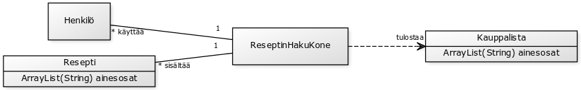

**Aihe:** Reseptikone. Toimii periaatteella ”reseptit, jotka ovat jo jääkaapissasi”. Koneeseen syötetään kaapissa olevat ruoka-aineet ja kone arpoo ruokaohjeen, jonka näistä aineksista saa aikaiseksi. Jos ei löydy reseptiä, johon kaikki ainekset löytyvät valmiina, kone kertoo sellaisen reseptin, josta käyttäjältä puuttuu mahdollisimman vähän aineksia, sekä antaa kauppalistan puuttuvista aineksista.

**Käyttäjät:** Koneen käyttäjä

**Koneen käyttäjän toiminnot:** 
- kaapissa olevien ainesten kertominen
- kaikkien reseptien listaus
- reseptien lisääminen

**Luokkakaavio:**

(edit later -osoite: http://yuml.me/edit/085768dc)
